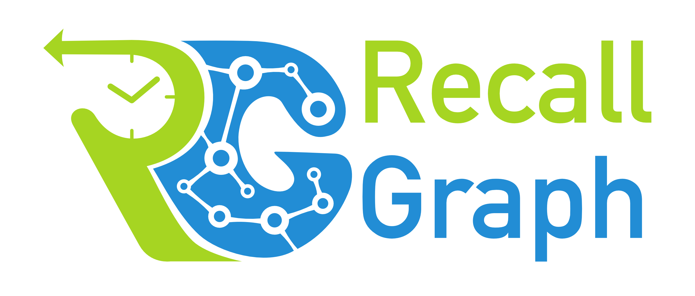

# Guide

## Before You Begin

Before starting to work with RecallGraph, take a few minutes to go through the background and terminology to set the context for understanding the terms used in this guide. To make things easier, essential concepts and terms used in this guide will be linked to their respective documentation.






If you are migrating from an older version, be sure to carefully go through the [changelog](../changelog.md) to understand what has changed. Take special note of **breaking changes**, if any.


## Initial Setup

Before starting with the guide, you need to have RecallGraph installed on a server you can access \(e.g. your `localhost`\). Follow the instructions provided in the link below:



After installation, once you login to the web console, you should see the service listed \(possibly among other installed services\) in the _SERVICES_ tab as shown below:

## Structure of this Guide


For all examples shown in the following sections, it is assumed that the service has been locally installed in a database named `acme_hrms`, with mount point `/recallgraph`. This is purely for convenience, and does not in any way affect the API's behavior.


RecallGraph works by maintaining an internal log of all changes that its tracked documents \(vertices/edges\) have gone through. Based on this log, it supports point-in-time \(i.e. historical\) lookbacks, traversals and even weighted shortest path queries.

To aid with the examples, we will build a simple narrative of an organization's employee database, where we track new hires, attrition, changes to reporting structure and designation \(promotions, temporary assignments, etc.\). The narrative will go through stages of first entering initial employees' data, followed by addition of new hires, a few cessations and a few internal movements. At each stage, the overall structure of the organization will be different, and we will see how to look at current and previous versions of  the organization.


This guide assumes minimal knowledge of ArangoDB and its web console \(esp Swagger\). Experienced users may find some sections a little tedious, but they had to be designed that way to help new developers get comfortable with the interface.


To align with the logical sequence of entering data, scanning the logs to identify interesting events and time points, and finally running historical graph and document queries _as of_ those time points, the guide is structured into the following sections, in order:







