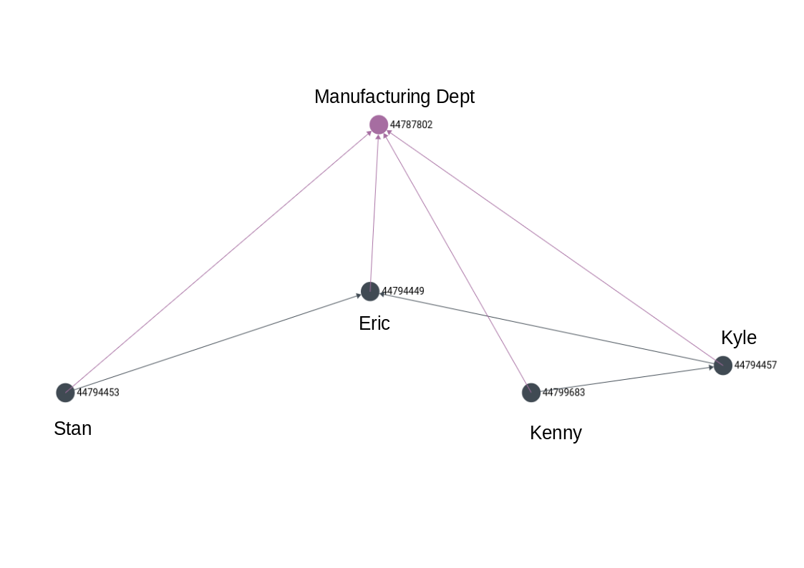

# k Shortest Paths

## The Setup

Finally, we take a moment to run a few weighted shortest path queries. For this, we will use a specific historical version of the graph - the one at the [end of the Create section](../persisting-documents/create.md#end-result). This graph has Kenny wrongly marked as reporting to Kyle. Let us look at the graph again \(reproduced below\):



Let us first manually enumerate the number of undirected paths \(with unique vertices\) that go from Kenny to Stan. They are as follows:

| \# | Path | Length |
| :--- | :--- | ---: |
| 1 | `KY -> M -> S` | 2 |
| 2 | `KY -> KL -> E -> S` | 3 |
| 3 | `KY -> KL -> M -> S` | 3 |
| 4 | `KY -> M -> E -> S` | 3 |
| 5 | `KY -> KL -> E -> M -> S` | 4 |
| 6 | `KY -> KL -> M -> E -> S` | 4 |
| 7 | `KY -> M -> KL  -> E -> S` | 4 |

Let us run some shortest path queries on this past version to see if get the results we expect.

## No Weight Function \(weight = 1\)

### Undirected Paths

We have not provided a weight function for the edges. This means **every edge carries a default weight of 1**. We allow **traversing in any direction over all edges**. We fix the max depth to 4, and set `k = 2` to return the 2 shortest paths.

**Request:**

| Param | Value |
| :--- | :--- |
| `timestamp` | `1588769414.948146` |
| `svid` | `employees/44799683` |
| `evid` | `employees/44794453` |
| `depth` | `4` |
| `k` | `2` |
| `body` | `{   "edges": {"reporting": "any", "membership": "any"} }` |

**Response:**

```text
[
  {
    "vertices": [
      {
        "role": "Safety Officer",
        "last_name": "McCormick",
        "first_name": "Kenny",
        "_rev": "_acmFz6u---",
        "_id": "employees/44799683",
        "_key": "44799683"
      },
      {
        "org": "ACME Inc.",
        "name": "Manufacturing",
        "_rev": "_ackLRwW---",
        "_id": "departments/44787802",
        "_key": "44787802"
      },
      {
        "role": "Plant Manager",
        "last_name": "Marsh",
        "first_name": "Stan",
        "_rev": "_aclQHSa---",
        "_id": "employees/44794453",
        "_key": "44794453"
      }
    ],
    "edges": [
      {
        "_rev": "_acmGvEa---",
        "_to": "departments/44787802",
        "_from": "employees/44799683",
        "_id": "membership/44799786",
        "_key": "44799786"
      },
      {
        "_rev": "_aclYlVu---",
        "_to": "departments/44787802",
        "_from": "employees/44794453",
        "_id": "membership/44795280",
        "_key": "44795280"
      }
    ],
    "cost": 2
  },
  {
    "vertices": [
      {
        "role": "Safety Officer",
        "last_name": "McCormick",
        "first_name": "Kenny",
        "_rev": "_acmFz6u---",
        "_id": "employees/44799683",
        "_key": "44799683"
      },
      {
        "org": "ACME Inc.",
        "name": "Manufacturing",
        "_rev": "_ackLRwW---",
        "_id": "departments/44787802",
        "_key": "44787802"
      },
      {
        "role": "Unit Supervisor",
        "last_name": "Cartman",
        "first_name": "Eric",
        "_rev": "_aclQHR6---",
        "_id": "employees/44794449",
        "_key": "44794449"
      },
      {
        "role": "Plant Manager",
        "last_name": "Marsh",
        "first_name": "Stan",
        "_rev": "_aclQHSa---",
        "_id": "employees/44794453",
        "_key": "44794453"
      }
    ],
    "edges": [
      {
        "_rev": "_acmGvEa---",
        "_to": "departments/44787802",
        "_from": "employees/44799683",
        "_id": "membership/44799786",
        "_key": "44799786"
      },
      {
        "_rev": "_aclYlUy---",
        "_to": "departments/44787802",
        "_from": "employees/44794449",
        "_id": "membership/44795272",
        "_key": "44795272"
      },
      {
        "_rev": "_acldI2S---",
        "_to": "employees/44794449",
        "_from": "employees/44794453",
        "_id": "reporting/44795731",
        "_key": "44795731"
      }
    ],
    "cost": 3
  }
]
```

We get 2 paths, one of length 2, and one of length 3, viz:

| \# | Path | Length |
| :--- | :--- | ---: |
| 1 | `KY -> M -> S` | 2 |
| 2 | `KY -> M -> E -> S` | 3 |


There are multiple paths of length 3 having equal weight for the given parameters, of which only one can be returned. In such cases, we **cannot predict** which one will be selected.


### Directed Paths

Let us now change the traversal criteria by adding an `inbound` constraint on the `membership` edge.

**Request:**

| Param | Value |
| :--- | :--- |
| `timestamp` | `1588769414.948146` |
| `svid` | `employees/44799683` |
| `evid` | `employees/44794453` |
| `depth` | `4` |
| `k` | `2` |
| `body` | `{   "edges": {     "reporting": "any",     "membership": "inbound"   } }` |

**Response:**

```text
[
  {
    "vertices": [
      {
        "role": "Safety Officer",
        "last_name": "McCormick",
        "first_name": "Kenny",
        "_rev": "_acmFz6u---",
        "_id": "employees/44799683",
        "_key": "44799683"
      },
      {
        "role": "Plant Manager",
        "last_name": "Broflovski",
        "first_name": "Kyle",
        "_rev": "_aclQHSm---",
        "_id": "employees/44794457",
        "_key": "44794457"
      },
      {
        "role": "Unit Supervisor",
        "last_name": "Cartman",
        "first_name": "Eric",
        "_rev": "_aclQHR6---",
        "_id": "employees/44794449",
        "_key": "44794449"
      },
      {
        "role": "Plant Manager",
        "last_name": "Marsh",
        "first_name": "Stan",
        "_rev": "_aclQHSa---",
        "_id": "employees/44794453",
        "_key": "44794453"
      }
    ],
    "edges": [
      {
        "_rev": "_acmHVwO---",
        "_to": "employees/44794457",
        "_from": "employees/44799683",
        "_id": "reporting/44799849",
        "_key": "44799849"
      },
      {
        "_rev": "_acldI3i---",
        "_to": "employees/44794449",
        "_from": "employees/44794457",
        "_id": "reporting/44795739",
        "_key": "44795739"
      },
      {
        "_rev": "_acldI2S---",
        "_to": "employees/44794449",
        "_from": "employees/44794453",
        "_id": "reporting/44795731",
        "_key": "44795731"
      }
    ],
    "cost": 3
  }
]
```

We are left with just 1 path that goes exclusively over the `reporting` edges, of length 3.

## Weight as a Function of Edge Collection

Let us cook up an artificial weight function that assigns a heavier weight to the `membership` edges, say 2. We can do this using the weight function shown in the sections below.


Weight functions are defined using the same constructs that are used to build [post-filters](../../../understanding-recallgraph/terminology/post-filters.md).


### No Vertex/Edge Filters

**Request:**

| Param | Value |
| :--- | :--- |
| `timestamp` | `1588769414.948146` |
| `svid` | `employees/44799683` |
| `evid` | `employees/44794453` |
| `depth` | `4` |
| `k` | `2` |
| `body` | `{   "edges": {     "reporting": "any",     "membership": "any",     "weightExpr": "_id.split('/')[0] === 'membership' ? 2 : 1"   } }` |


You can go real crazy with post-filter-like expressions, but it is probably best to keep them simple for the sake of readability.


**Response:**

```text
[
  {
    "vertices": [
      {
        "role": "Safety Officer",
        "last_name": "McCormick",
        "first_name": "Kenny",
        "_rev": "_acmFz6u---",
        "_id": "employees/44799683",
        "_key": "44799683"
      },
      {
        "role": "Plant Manager",
        "last_name": "Broflovski",
        "first_name": "Kyle",
        "_rev": "_aclQHSm---",
        "_id": "employees/44794457",
        "_key": "44794457"
      },
      {
        "role": "Unit Supervisor",
        "last_name": "Cartman",
        "first_name": "Eric",
        "_rev": "_aclQHR6---",
        "_id": "employees/44794449",
        "_key": "44794449"
      },
      {
        "role": "Plant Manager",
        "last_name": "Marsh",
        "first_name": "Stan",
        "_rev": "_aclQHSa---",
        "_id": "employees/44794453",
        "_key": "44794453"
      }
    ],
    "edges": [
      {
        "_rev": "_acmHVwO---",
        "_to": "employees/44794457",
        "_from": "employees/44799683",
        "_id": "reporting/44799849",
        "_key": "44799849"
      },
      {
        "_rev": "_acldI3i---",
        "_to": "employees/44794449",
        "_from": "employees/44794457",
        "_id": "reporting/44795739",
        "_key": "44795739"
      },
      {
        "_rev": "_acldI2S---",
        "_to": "employees/44794449",
        "_from": "employees/44794453",
        "_id": "reporting/44795731",
        "_key": "44795731"
      }
    ],
    "cost": 3
  },
  {
    "vertices": [
      {
        "role": "Safety Officer",
        "last_name": "McCormick",
        "first_name": "Kenny",
        "_rev": "_acmFz6u---",
        "_id": "employees/44799683",
        "_key": "44799683"
      },
      {
        "org": "ACME Inc.",
        "name": "Manufacturing",
        "_rev": "_ackLRwW---",
        "_id": "departments/44787802",
        "_key": "44787802"
      },
      {
        "role": "Plant Manager",
        "last_name": "Marsh",
        "first_name": "Stan",
        "_rev": "_aclQHSa---",
        "_id": "employees/44794453",
        "_key": "44794453"
      }
    ],
    "edges": [
      {
        "_rev": "_acmGvEa---",
        "_to": "departments/44787802",
        "_from": "employees/44799683",
        "_id": "membership/44799786",
        "_key": "44799786"
      },
      {
        "_rev": "_aclYlVu---",
        "_to": "departments/44787802",
        "_from": "employees/44794453",
        "_id": "membership/44795280",
        "_key": "44795280"
      }
    ],
    "cost": 4
  }
]
```

The 2-hop path now incurs a cost of 4! It is therefore, 2nd in the list.

| \# | Path | Length | Cost |
| :--- | :--- | ---: | ---: |
| 1 | `KY -> KY -> E -> S` | 3 | 3 |
| 2 | `KY -> M -> S` | 2 | 4 |

### No Cartman

Finally, let us add a vertex filter that rejects any path containing Eric as a vertex.


Vertex and edge filters also use post-filter syntax.


**Request:**

| Param | Value |
| :--- | :--- |
| `timestamp` | `1588769414.948146` |
| `svid` | `employees/44799683` |
| `evid` | `employees/44794453` |
| `depth` | `4` |
| `k` | `2` |
| `body` | `{   "edges": {     "reporting": "any",     "membership": "any",     "weightExpr": "_id.split('/')[0] === 'membership' ? 2 : 1",     "vFilter": "_key !== '44794449'"   } }` |

**Response:**

```text
[
  {
    "vertices": [
      {
        "role": "Safety Officer",
        "last_name": "McCormick",
        "first_name": "Kenny",
        "_rev": "_acmFz6u---",
        "_id": "employees/44799683",
        "_key": "44799683"
      },
      {
        "org": "ACME Inc.",
        "name": "Manufacturing",
        "_rev": "_ackLRwW---",
        "_id": "departments/44787802",
        "_key": "44787802"
      },
      {
        "role": "Plant Manager",
        "last_name": "Marsh",
        "first_name": "Stan",
        "_rev": "_aclQHSa---",
        "_id": "employees/44794453",
        "_key": "44794453"
      }
    ],
    "edges": [
      {
        "_rev": "_acmGvEa---",
        "_to": "departments/44787802",
        "_from": "employees/44799683",
        "_id": "membership/44799786",
        "_key": "44799786"
      },
      {
        "_rev": "_aclYlVu---",
        "_to": "departments/44787802",
        "_from": "employees/44794453",
        "_id": "membership/44795280",
        "_key": "44795280"
      }
    ],
    "cost": 4
  },
  {
    "vertices": [
      {
        "role": "Safety Officer",
        "last_name": "McCormick",
        "first_name": "Kenny",
        "_rev": "_acmFz6u---",
        "_id": "employees/44799683",
        "_key": "44799683"
      },
      {
        "role": "Plant Manager",
        "last_name": "Broflovski",
        "first_name": "Kyle",
        "_rev": "_aclQHSm---",
        "_id": "employees/44794457",
        "_key": "44794457"
      },
      {
        "org": "ACME Inc.",
        "name": "Manufacturing",
        "_rev": "_ackLRwW---",
        "_id": "departments/44787802",
        "_key": "44787802"
      },
      {
        "role": "Plant Manager",
        "last_name": "Marsh",
        "first_name": "Stan",
        "_rev": "_aclQHSa---",
        "_id": "employees/44794453",
        "_key": "44794453"
      }
    ],
    "edges": [
      {
        "_rev": "_acmHVwO---",
        "_to": "employees/44794457",
        "_from": "employees/44799683",
        "_id": "reporting/44799849",
        "_key": "44799849"
      },
      {
        "_rev": "_aclYlWC---",
        "_to": "departments/44787802",
        "_from": "employees/44794457",
        "_id": "membership/44795286",
        "_key": "44795286"
      },
      {
        "_rev": "_aclYlVu---",
        "_to": "departments/44787802",
        "_from": "employees/44794453",
        "_id": "membership/44795280",
        "_key": "44795280"
      }
    ],
    "cost": 5
  }
]
```

Now with Cartman gone, we again have our 2-hop path \(still with cost 4\) turning out to be the cheapest!


