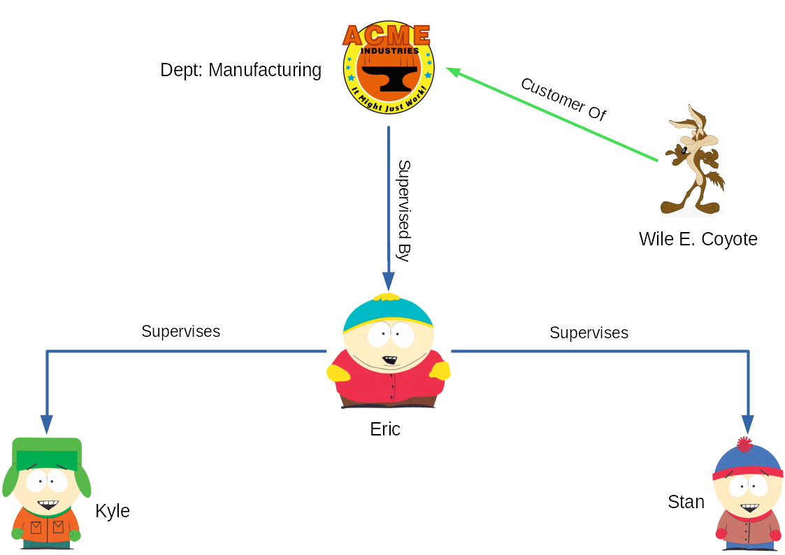
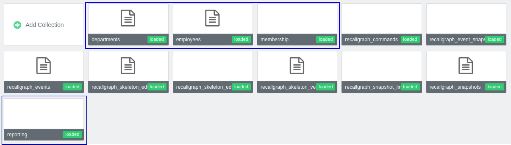
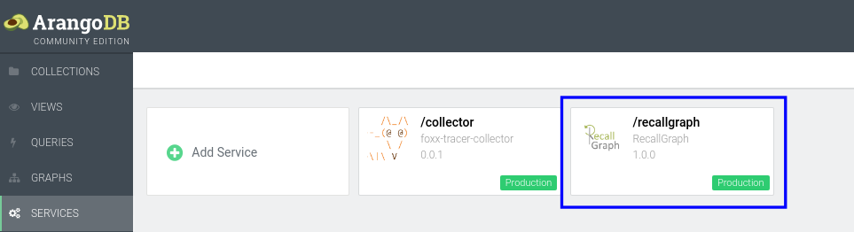
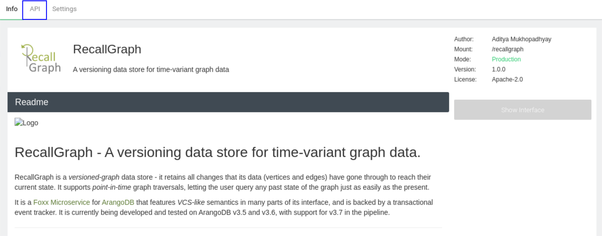
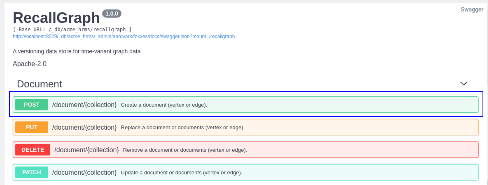
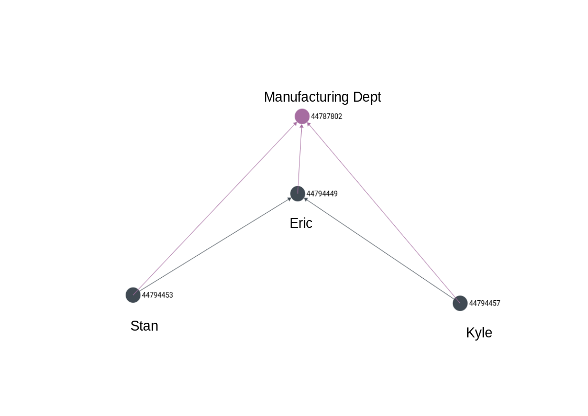
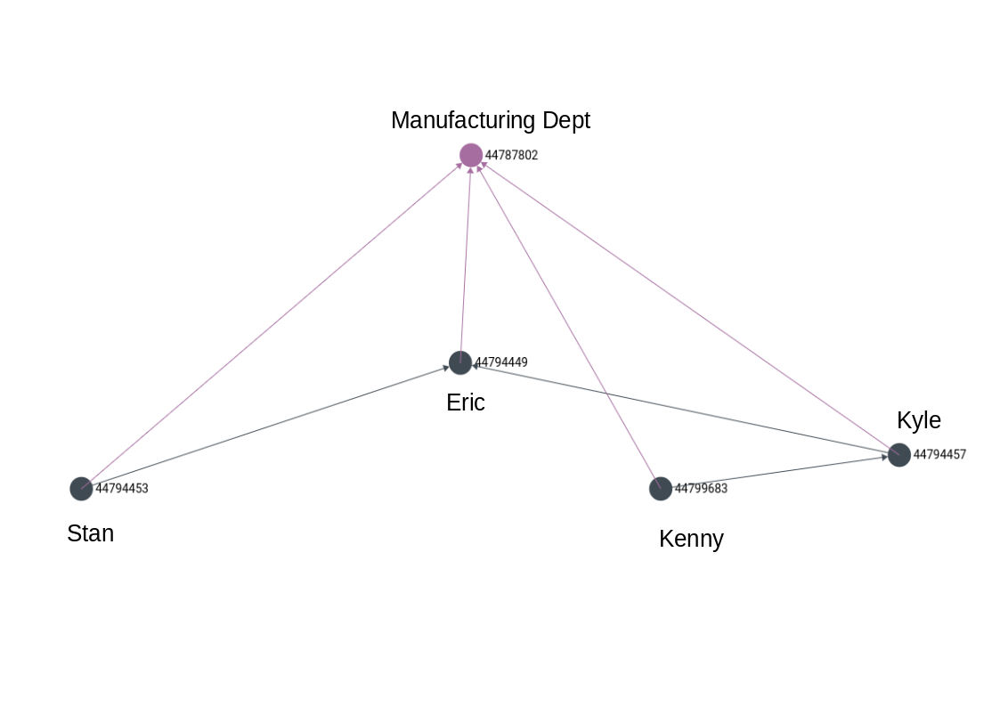

# Create

## The Story So Far...

> By now, Eric has realized the need for a full-fledged [HRMS](https://en.wikipedia.org/wiki/Human_resource_management_system) to keep track of payroll, reporting structure, etc. for his growing department, and has (wisely) selected a product that happens to use RecallGraph under the hood.

### Org Info and Initial Employees

Initially, before Kenny is hired, the org structure looks something like this:



## Initializing the Database

In order to represent the current state of the organization, we must first define the necessary collections in the database where RecallGraph is installed. This is done using the regular DB methods and does not need any RecallGraph-specific operations. The collections are:

* `departments` (Vertex)
* `employees` (Vertex)
* `reporting` (Edge - Reporting relationships)
* `membership` (Edge - Employee-Department relationships)

After creation, the list of collections will look something like this (in the web console):




Our example HRMS does not track customer relations, but a real-world full-fledged ERP will (and can also theoretically use RecallGraph as a backend).


## Entering Data

We start by entering data on the core entities (departments and employees), followed by defining the relations between them.

### Core Entities

#### Department Information

We begin by entering data for the manufacturing department. In your web console, navigate to the services tab and click on the box that says /_recallgraph_ (assuming you mounted the service at `/recallgraph`).



Now click on the _API_ tab to access the Swagger interface.



Once inside, click on the first green bar _\_marked_  _in the \_Documents_ category.



Once this tab is expanded, click on the  button. You will now be presented with a form containing fields that map to request parameters for the `POST` request.

In the `collection` field, fill in `departments` as we will enter the department first.

.png>)

Next, jump straight to the `body` field and here we can fill in any valid JSON object. For this example, we use the following:

`{`\
&#x20; `"name": "Manufacturing",`\
&#x20; `"org": "ACME Inc."`\
`}`

Next click on the `Execute` button and see the result. We should see a response similar to:

.png>)


Note that the corresponding `curl` command is also shown for the request, and you can use it to achieve the same result.


The response body contains the `_id` of the newly created department object, and we make a note of it for reference later on:

```
{
  "_id": "departments/44787802",
  "_key": "44787802",
  "_rev": "_ackLRwW---"
}
```

#### Employee Information

We will use the _bulk mode_ to create all employees in one go. The endpoint remains the same.

1. In the `collections` field, enter `employees`.
2. We want to map the generated document `_ids` to the employee names. So we set `returnNew` to `true`.
3. In the `body` field, enter the following **JSON array**:\
   `[`\
   &#x20; `{`\
   &#x20;   `"first_name": "Eric",`\
   &#x20;   `"last_name": "Cartman",`\
   &#x20;   `"role": "Unit Supervisor"`\
   &#x20; `},`\
   &#x20; `{`\
   &#x20;   `"first_name": "Stan",`\
   &#x20;   `"last_name": "Marsh",`\
   &#x20;   `"role": "Plant Manager"`\
   &#x20; `},`\
   &#x20; `{`\
   &#x20;   `"first_name": "Kyle",`\
   &#x20;   `"last_name": "Broflovski",`\
   &#x20;   `"role": "Plant Manager"`\
   &#x20; `}`\
   `]`
4.  Hit the `Execute` button to get a result similar to:

    ```
    [
      {
       "_id": "employees/44794449",
       "_key": "44794449",
       "_rev": "_aclQHR6---",
       "new": {
         "_key": "44794449",
         "_id": "employees/44794449",
         "_rev": "_aclQHR6---",
         "first_name": "Eric",
         "last_name": "Cartman",
         "role": "Unit Supervisor"
       }
      },
      {
       "_id": "employees/44794453",
       "_key": "44794453",
       "_rev": "_aclQHSa---",
       "new": {
         "_key": "44794453",
         "_id": "employees/44794453",
         "_rev": "_aclQHSa---",
         "first_name": "Stan",
         "last_name": "Marsh",
         "role": "Plant Manager"
       }
      },
      {
       "_id": "employees/44794457",
       "_key": "44794457",
       "_rev": "_aclQHSm---",
       "new": {
         "_key": "44794457",
         "_id": "employees/44794457",
         "_rev": "_aclQHSm---",
         "first_name": "Kyle",
         "last_name": "Broflovski",
         "role": "Plant Manager"
       }
      }
    ]
    ```

### Relations

#### Membership

Now that employees have been added to the database, we need to make them all belong to the _Manufacturing_ department. We will do this by inserting edges pointing from each employee to the _Manufacturing_ department vertex created earlier.

**Request similar to:**

| **Param**    | Value                                                                                                                                                                                                                                                                                                                                                                                                                                                                            |
| ------------ | -------------------------------------------------------------------------------------------------------------------------------------------------------------------------------------------------------------------------------------------------------------------------------------------------------------------------------------------------------------------------------------------------------------------------------------------------------------------------------- |
| `collection` | `membership`                                                                                                                                                                                                                                                                                                                                                                                                                                                                     |
| `body`       | <p><code>[</code><br>  <code>{</code><br>    <code>"_from": "employees/44794449",</code><br>    <code>"_to": "departments/44787802"</code><br>  <code>},</code><br>  <code>{</code><br>    <code>"_from": "employees/44794453",</code><br>    <code>"_to": "departments/44787802"</code><br>  <code>},</code><br>  <code>{</code><br>    <code>"_from": "employees/44794457",</code><br>    <code>"_to": "departments/44787802"</code><br>  <code>}</code><br><code>]</code></p> |

**Response similar to:**

```
[
  {
    "_id": "membership/44795272",
    "_key": "44795272",
    "_rev": "_aclYlUy---"
  },
  {
    "_id": "membership/44795280",
    "_key": "44795280",
    "_rev": "_aclYlVu---"
  },
  {
    "_id": "membership/44795286",
    "_key": "44795286",
    "_rev": "_aclYlWC---"
  }
]
```

#### Reporting

We need to add a couple of reporting relations to represent Kyle and Stan reporting to Eric. We do this as follows:

**Request similar to:**

| **Param**    | Value                                                                                                                                                                                                                                                                                                                          |
| ------------ | ------------------------------------------------------------------------------------------------------------------------------------------------------------------------------------------------------------------------------------------------------------------------------------------------------------------------------ |
| `collection` | `reporting`                                                                                                                                                                                                                                                                                                                    |
| `body`       | <p><code>[</code><br>  <code>{</code><br>    <code>"_from": "employees/44794453",</code><br>    <code>"_to": "employees/44794449"</code><br>  <code>},</code><br>  <code>{</code><br>    <code>"_from": "employees/44794457",</code><br>    <code>"_to": "employees/44794449"</code><br>  <code>}</code><br><code>]</code></p> |

**Response similar to:**

```
[
  {
    "_id": "reporting/44795731",
    "_key": "44795731",
    "_rev": "_acldI2S---"
  },
  {
    "_id": "reporting/44795739",
    "_key": "44795739",
    "_rev": "_acldI3i---"
  }
]
```

### Intermediate Result

After inserting all the above, we can get a view of the current state of all inserted objects and their relations by running the following graph query:

```
for v, e, p in 1..2
inbound "departments/44787802"
reporting, membership

return p
```

The result (in graph viewer) should look like this:



### Adding Kenny

Now that the initial members and their relationships have been defined in the system, it is time to add details of the new hire - Kenny. This is done in steps similar to above:

1. Adding employee information
2. Adding department membership
3. Adding reporting relationship.

However, in a case of human error, Kenny was added as reporting to Kyle rather than Eric.&#x20;

.png>)

## End Result

The end result is shown below:


