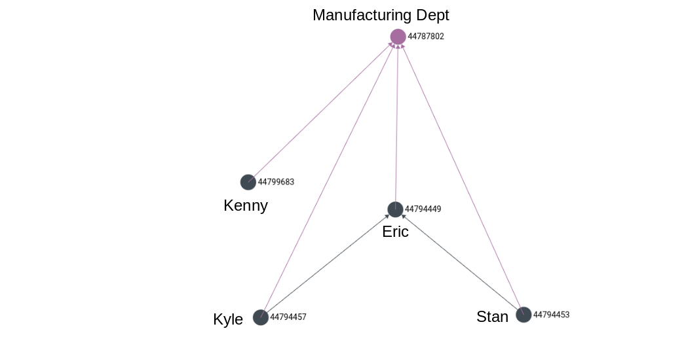
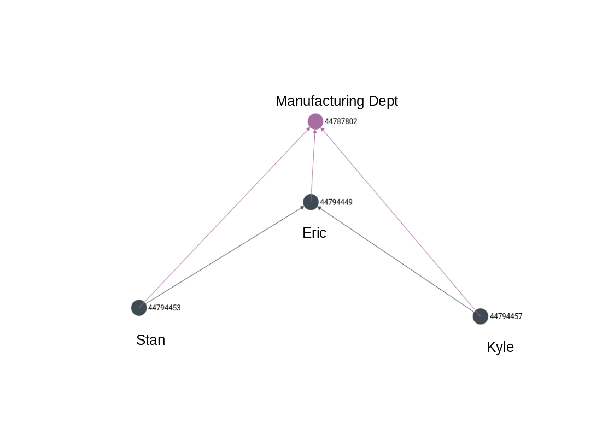

# Delete

## The Story So Far...

> All is well in ACME Industries. Production is running at blinding speed and the shipment of 10000 explosive tennis balls is nearly ready. One day, near the end of this production cycle, Stan and Kyle had a few hours to kill after lunch, so they decide to spend it playing their favorite sport - Tennis!
>
> Of course, with so many tennis balls of the explosive kind lying around the place, they had to be careful not to inadvertently start playing with one of them \(Mr. Coyote had specifically asked for them to look, feel and weigh almost identical to real tennis balls\). But they were not worried, since they had a qualified Safety Officer to help with the matter.
>
> Kenny had always claimed to be extra careful in his handling of explosive material, and was super confident that the ball they had in hand was not of the explosive variety. Kyle and Stan were not too sure and asked if there was a way to check. Kenny, in a moment of absolute self-certainty, decided to give them a demonstration \(Kyle and Stan insisted on keeping a safe distance, nevertheless\). Kenny proceeded to firmly grip the tennis ball and with all his might, whacked it at the wall next to him.

We will now explore how to delete entities through RecallGraph's API. Kenny is no longer in the active employ of ACME Inc. We need to mark his employment duration as over, and dismantle his reporting relationship to Eric.


The end of Kenny's employment can be marked using a a field named `leaving_date` in his personal data object. This can be done using the UPDATE endpoint as discussed earlier. Note that this too would be accompanied by a `valid_from` date if RecallGraph were bi-temporal. We will add it for now, nevertheless.


## Entering Data

In the Swagger console locate the tab with the  button. The `collection` parameter should be set to `reporting` and the body need contain **only the `_id` or the `_key`** of the entity.

**Request:**

```text
{
    "_key": "44799849"
}
```

**Response:**

```text
{
  "_id": "reporting/44799849",
  "_key": "44799849",
  "_rev": "_acmeb3S--_"
}
```

### Intermediate Result

```text
//Query
for r in reporting
filter r._key == '44799849'
return r

Result
[]
```



### Removing the Department Membership Relation

Similar to removing his reporting relation, we can remove his department membership relation. This is left as an exercise for the reader.

## End Result

The end result should look exactly like it [looked as in the `CREATE` operation](create.md#intermediate-result), just before adding any information on Kenny.




Although not demonstrated in this example, this endpoint also supports bulk delete, similar to [`CREATE`](create.md#employee-information).


