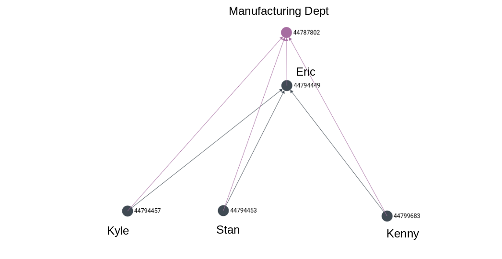

# Replace

## The Story So Far...

> All data for the organization has been entered, albeit with an error. Kenny, the newly hired Safety Officer, has been recorded as reporting to Kyle rather than the Unit Supervisor, Eric.

We will correct this data entry error in our database by replacing the incorrect reporting edge. After replacement, Kenny should be correctly shown to be reporting to Eric.


**Important:** Note that the `REPLACE` operation behaves exactly as in the ArangoDB core REST API. It **does not** replace the underlying document, i.e. the body is replaced but the `_key` remains the same.



If you missed taking note of the edge `_id` while inserting the reporting relationship between Kenny and Kyle, you can easily retrieve it by firing a simple AQL query. This is an exercise left for the reader.


## Entering Data

In the Swagger console locate the tab with the  button. The `collection` parameter should be set to `reporting` and the body should contain the **entire contents** of the new reporting relationship.


1. Only one of `_key` or `_id` need be present.
2. `_rev` can be omitted \(ignored if present\).


```text
{
    "_id": "reporting/44799849",
    "_from": "employees/44799683",
    "_to": "employees/44794449"
}
```

## End Result

Running the graph query should now yield the correct relations:




Although not demonstrated in this example, this endpoint also supports bulk replace, similar to [`CREATE`](create.md#employee-information).


